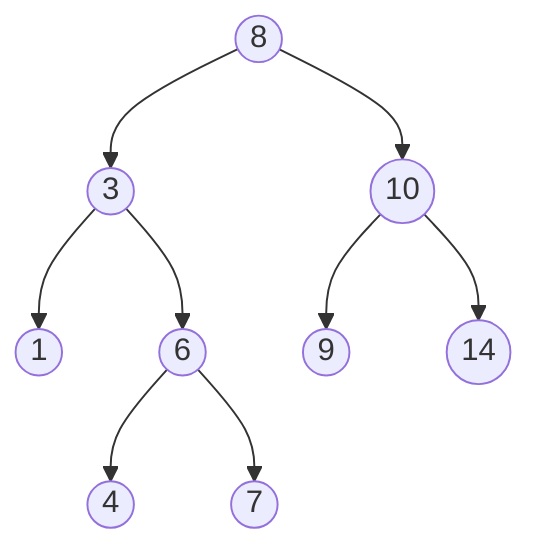

# C/C++ exercises
PT
> Exercícios usando a linguagem de programação C/C++. Estou refatorando alguns exercícios de faculdade. Alguns deles feitos durante as aulas da faculdade ou usando compiladores online, isso explica a falta de legibilidade.

EN
> Exercises using the C/C++ programming language. I'm refactoring some college exercises. Some of them made in during college classes or using online compilers, this explains the lack of readability.

#### Referências Bibliográficas
 -  ASCENCIO, Ana Fernanda Gomes. **Fundamentos da programação de computadores: algoritmos, PASCAL, C/C++ (padrão ANSI) e JAVA** \ Ana Fernanda Gomes Ascencio e Edilene Aparecida Veneruchi de Campos. -- 3. ed. – São Paulo: Pearson Education do Brasil, 2012.

-  ASCENCIO, Ana Fernanda Gomes. **Estruturas de dados: algoritmos, análise da complexidade e implementações
em JAVA e C/C++** \ Ana Fernanda Gomes Ascencio e Graziela Santos de Araújo. – São Paulo: Pearson Prentice Hall, 2010.

> Diagram of Heap in [heap.cpp](/07_EstruturaDeDados/heap.cpp)

